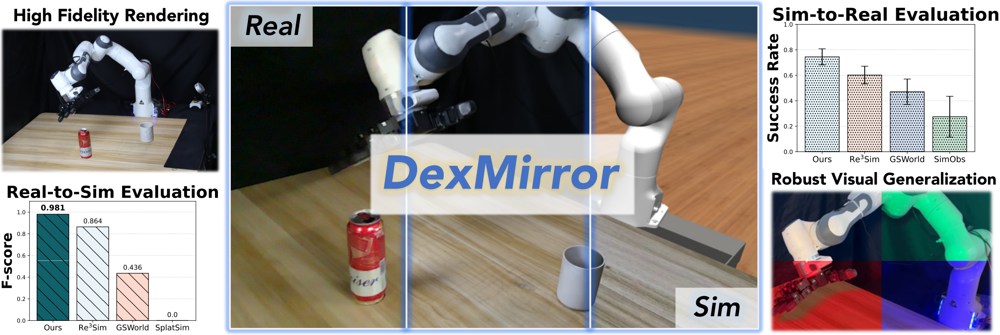

<h1 align="center">DexMirror</h1>
<h3 align="center">Real-to-Sim Scene Mirroring for<br>Sim-to-Real Dexterous Manipulation</h3>

<p align="center">[Author names]</p>
<p align="center">[Affiliations]</p>
<!-- Replace the author and affiliation placeholders with the final author list. -->

<p align="center"><strong>NeurIPS 2026</strong></p>
<p align="center">
  <a href=""></a>
  <a href=""></a>
  <a href="https://huggingface.co/datasets/limonkig/dexmirror-scenes"></a>
</p>
<!-- Add the arXiv and poster URLs to the empty href attributes above. -->

This repository provides the scene reconstruction code for **DexMirror: Real-to-Sim Scene Mirroring for Sim-to-Real Dexterous Manipulation**, accepted at **NeurIPS 2026**. DexMirror represents the background and interactable objects as separate 3D Gaussian models, with joint optimization over background, object, and composed views. The resulting assets support photorealistic rendering and independent object placement.

<p align="center">
  
</p>

[Setup](#setup) · [Build a dataset](#build-a-dataset) · [Run DexMirror](#run-dexmirror) · [Use the results](#use-the-results) · [Evaluation](#evaluation) · [中文数据集指南](docs/dataset_preparation_zh.md)

## Setup

Install **3DGS** for training, rendering, and evaluation. To prepare your own dataset, also install **COLMAP**, **Depth Anything V2**, and **SAM2** below.

The instructions below target Linux with an NVIDIA GPU, a compatible driver, Conda, and a C++ compiler. The reconstruction experiments were run with Python 3.8.20, PyTorch 2.0.0, and CUDA 11.8. GPU memory use depends on image resolution, view count, and the number of objects.

### COLMAP

We retain the upstream 3DGS [convert.py](convert.py) script for feature extraction, matching, reconstruction, and image undistortion. It uses the COLMAP 3.x command-line options. On Ubuntu 22.04, the system package is a convenient CPU setup:

```bash
sudo apt-get update
sudo apt-get install -y colmap ffmpeg build-essential git
colmap -h
```

Use `--no_gpu` when running `convert.py` with a CPU-only COLMAP build. Distribution packages generally omit CUDA support; GPU feature extraction requires a CUDA-enabled build. See the [official installation guide](https://colmap.github.io/install.html).

<details>
<summary>Build COLMAP 3.9.1 with CUDA on Ubuntu</summary>

Install a CUDA toolkit first. This example uses CUDA 11.8 at `/usr/local/cuda-11.8`; adjust the compiler path for your installation. Dependencies follow the [COLMAP 3.9 installation instructions](https://colmap.github.io/legacy/3.9/install.html).

```bash
sudo apt-get install -y cmake ninja-build build-essential \
  libboost-program-options-dev libboost-filesystem-dev \
  libboost-graph-dev libboost-system-dev libeigen3-dev libflann-dev \
  libfreeimage-dev libmetis-dev libgoogle-glog-dev libgtest-dev \
  libsqlite3-dev libglew-dev qtbase5-dev libqt5opengl5-dev \
  libcgal-dev libceres-dev

git clone --branch 3.9.1 --depth 1 https://github.com/colmap/colmap.git
cmake -S colmap -B colmap/build -GNinja \
  -DCMAKE_BUILD_TYPE=Release -DCUDA_ENABLED=ON \
  -DCMAKE_CUDA_COMPILER=/usr/local/cuda-11.8/bin/nvcc
cmake --build colmap/build --parallel 8
sudo cmake --install colmap/build
colmap -h
```

For other operating systems or newer COLMAP versions, follow the official instructions and check compatibility with the options used by `convert.py`.

</details>

### 3DGS

Our implementation builds on the official [GRAPHDECO 3D Gaussian Splatting repository](https://github.com/graphdeco-inria/gaussian-splatting). Clone this repository with its submodules:

```bash
git clone --branch cm_triple_dev --recursive \
  https://github.com/piao-0429/gaussian-splatting-joint.git
cd gaussian-splatting-joint
export REPO="$PWD"

conda env create -f environment.yml
conda activate dexmirror
```

The [environment file](environment.yml) pins the Python/PyTorch packages used by our reconstruction runs and selects only the `conda-forge` channel, so custom default channels do not affect installation. CUDA extensions are installed **after** PyTorch is available. A full CUDA 11.8 toolkit, including `nvcc`, is needed to compile them; the PyTorch wheel does not supply the compiler. This follows the [upstream 3DGS build requirements](https://github.com/graphdeco-inria/gaussian-splatting#software-requirements).

```bash
export CUDA_HOME=/usr/local/cuda-11.8
export PATH="$CUDA_HOME/bin:$PATH"
nvcc --version

python -m pip install --no-build-isolation ./submodules/diff-gaussian-rasterization
python -m pip install --no-build-isolation ./submodules/simple-knn
python -m pip install --no-build-isolation ./submodules/fused-ssim

python -m pip check
python -c "import torch, diff_gaussian_rasterization, simple_knn._C, fused_ssim; print(torch.__version__, torch.version.cuda, torch.cuda.is_available())"
```

If the repository was cloned without submodules, run `git submodule update --init --recursive` first. Keep the recorded submodule revisions for this setup. TensorBoard is optional; the trainer also writes a JSONL metrics log.

### For building datasets: Depth Anything V2 and SAM2

Use separate environments for the data preparation models. In particular, current SAM2 requires Python ≥3.10, PyTorch ≥2.5.1, and torchvision ≥0.20.1, which differ from the reconstruction environment. See [SAM2 installation](https://github.com/facebookresearch/sam2#installation) and the [official PyTorch version matrix](https://pytorch.org/get-started/previous-versions/).

<details>
<summary>Install Depth Anything V2 and download its checkpoint</summary>

Install the official repository and its dependencies, then download the Large checkpoint. The model setup and command-line options are documented in [Depth Anything V2](https://github.com/DepthAnything/Depth-Anything-V2#usage).

```bash
conda create -n depth-anything python=3.10 pip -y --override-channels -c conda-forge
conda activate depth-anything
git clone https://github.com/DepthAnything/Depth-Anything-V2.git "$REPO/../Depth-Anything-V2"
export DEPTH_ROOT="$REPO/../Depth-Anything-V2"
cd "$DEPTH_ROOT"
python -m pip install torch==2.5.1 torchvision==0.20.1 \
  --index-url https://download.pytorch.org/whl/cu118
python -m pip install -r requirements.txt "numpy<2" "opencv-python<4.12"
mkdir -p checkpoints
curl -fL \
  https://huggingface.co/depth-anything/Depth-Anything-V2-Large/resolve/main/depth_anything_v2_vitl.pth \
  -o checkpoints/depth_anything_v2_vitl.pth
```

</details>

<details>
<summary>Install SAM2 and download its checkpoint</summary>

Install SAM2 with the notebook dependencies and download the SAM 2.1 Large checkpoint. The same CUDA 11.8 toolkit can build its optional extension with the PyTorch wheel below. [Official installation and checkpoints](https://github.com/facebookresearch/sam2#installation).

```bash
conda create -n sam2 python=3.10 pip -y --override-channels -c conda-forge
conda activate sam2
git clone https://github.com/facebookresearch/sam2.git "$REPO/../sam2"
export SAM2_ROOT="$REPO/../sam2"
cd "$SAM2_ROOT"
python -m pip install torch==2.5.1 torchvision==0.20.1 \
  --index-url https://download.pytorch.org/whl/cu118
python -m pip install setuptools wheel
python -m pip install --no-build-isolation -e ".[notebooks]" "numpy<2" "opencv-python<4.12"
mkdir -p checkpoints
curl -fL \
  https://dl.fbaipublicfiles.com/segment_anything_2/092824/sam2.1_hiera_large.pt \
  -o checkpoints/sam2.1_hiera_large.pt
```

</details>

SAM2 accepts point and box prompts. We provide [a command-line mask exporter](scripts/generate_sam2_masks.py) and [a frame-name mapping helper](scripts/sam2_frame_mapping.py) for the dataset workflow below. Interactive refinement is also available through the official [video predictor notebook](https://github.com/facebookresearch/sam2/blob/main/notebooks/video_predictor_example.ipynb).

## Build a dataset

**Use our prepared scenes:** download the Franka Pour Coke and Real2Sim ZIPs from [Hugging Face](https://huggingface.co/datasets/limonkig/dexmirror-scenes/tree/main). Check them against `SHA256SUMS`, then extract the archives to obtain `franka_pour_coke/` and `real2sim/`. Set `DATASET` to the extracted scene folder and continue with [Run DexMirror](#run-dexmirror).

**Build your own dataset:** capture overlapping views of a static scene both **with the target objects present** and **with them removed**. The background and objects must share one camera reconstruction.

| Step | What you prepare |
| --- | --- |
| 1. Reconstruct cameras | Run COLMAP on all captures and undistort the images. |
| 2. Organize views | Separate background views (`images/`) and object-containing views (`images_ft/`). |
| 3. Estimate depth | Predict depth with Depth Anything V2 and calibrate it against COLMAP. |
| 4. Segment objects | Prompt SAM2, inspect the masks, and restore their original image names. |
| 5. Extract points | Use the masks to extract object point clouds for initialization. |

Follow the **[dataset preparation guide](docs/dataset_preparation.md)** for the COLMAP workflow, folder layout, and mask examples. A [Chinese guide](docs/dataset_preparation_zh.md) provides the same workflow with additional mask checks. If you already have a prepared dataset in this layout, continue with training.

## Run DexMirror

Set the dataset and output paths, then train with the 100,000-step schedule used in our reconstruction runs. Object pretraining runs through iteration 7999; joint training starts at iteration 8000.

**For held-out evaluation, add `--eval` to this training command from the start.** Without it, all registered views are used for training. See [Evaluation](#evaluation) for how to score the saved model.

```bash
conda activate dexmirror
cd /absolute/path/to/gaussian-splatting-joint
export DATASET=/absolute/path/to/datasets/my_scene
export MODEL_DIR="$PWD/output/my_scene"
export OBJ_INIT="$DATASET/aligned_sparse/0/points3D.ply"

python train.py \
  -s "$DATASET" -m "$MODEL_DIR" \
  -d "$DATASET/depth" \
  --ft_masks "$DATASET/masks_ft_obj" \
  --obj_ply_path "$OBJ_INIT" \
  --object_only_until_iter 8000 \
  --iterations 100000 \
  --mask_prune_on_save \
  --mask_prune_min_prop 0.6 \
  --mask_prune_expand 2 \
  --save_iterations 7000 10000 30000 100000 \
  --checkpoint_iterations 7000 10000 30000 60000 90000 100000
```

Training runs without a viewer server. Check that the background views and object masks load successfully at startup.

<details>
<summary>Initialization, GPU memory, pruning, and resuming a run</summary>

To use the extracted object union instead, replace the `OBJ_INIT` assignment above with `$DATASET/mask_pruned/point3D_objects.ply`. All object models currently share the same initialization file; a point cloud containing only one target object is unsuitable for initializing the other objects.

If image storage exceeds GPU memory, try `--data_device cpu` or a lower resolution such as `-r 2`.

Mask-based pruning occurs at the save iterations above. To control it independently, replace `--mask_prune_on_save` with an explicit list such as `--prune_iterations 30000 100000`.

Resume an interrupted run from a full joint checkpoint:

```bash
python train.py --start_checkpoint "$MODEL_DIR/chkpnt60000.pth"
```

The checkpoint restores the saved run configuration, background and object models, optimizers, samplers, and random state. Explicit command-line arguments override the saved configuration.

</details>

## Use the results

### Model files

The saved model contains **background Gaussians** (`point_cloud.ply`) and **separate object Gaussians** (`obj.ply`, `obj_1.ply`, …). Keep the configuration, camera information, and metadata with them. Training progress is recorded in `training_metrics.jsonl`; `chkpnt*.pth` files allow training to resume.

<details>
<summary>Output directory layout</summary>

```text
output/my_scene/
├── training_config.json
├── training_metrics.jsonl
├── cameras.json
├── exposure.json
├── input.ply
├── chkpnt100000.pth
└── point_cloud/iteration_100000/
    ├── point_cloud.ply           # Background Gaussians
    ├── obj.ply                   # Object index 0
    ├── obj_1.ply                 # Object index 1; further objects follow
    ├── model_meta.json
    └── exposure.json
```

</details>

These are visual assets; collision meshes and physical parameters for a simulator must be prepared separately.

### Render the reconstructed scene

```bash
python render_joint.py -m "$MODEL_DIR" --iteration 100000 \
  --split finetune --merge_objects --no_move \
  --output_root "$MODEL_DIR/render_100000"
```

Background renders are written to `render_100000/finetune/`, and the background-plus-object renders to `render_100000/finetune_merged/`. **Use `--no_move` to preserve the reconstructed object positions**; otherwise the rendering scripts apply their built-in demonstration translations.

<details>
<summary>Render individual objects</summary>

Render the objects without the background:

```bash
python render_joint_only_obj.py -m "$MODEL_DIR" --iteration 100000 \
  --split finetune --no_move \
  --output_root "$MODEL_DIR/render_objects_100000"
```

Use `--include_objects` to select objects. For a two-object scene, `--include_objects "1,0"` includes only object index 0. The PLY files can also be loaded into a compatible Gaussian viewer; the repository's renderers handle the saved joint-model metadata.

</details>

## Evaluation

Run evaluation in the `dexmirror` environment with the original dataset accessible:

```bash
python eval.py -m "$MODEL_DIR" --iteration 100000 --sample_count 6
```

This reports **L1 ↓, PSNR ↑, and SSIM ↑** for the background, composed scene, and individual objects where matching views are available. Open `$MODEL_DIR/eval/` to inspect:

| Output | Contents |
| --- | --- |
| `metrics_iter100000.json` | Average metrics and view counts for each group. |
| `<group>/per_view_metrics.json` | Scores for each image. |
| `<group>/*.png` | **Ground truth \| render \| absolute error** panels. |

`--sample_count 6` saves up to six preview panels per group; metrics still use all eligible views.

**Test-view scores require a model trained with `--eval`.** Otherwise, the reported scores measure training-view reconstruction. Object scores use masked images averaged over the full image area. Per-view files and previews are reused across iterations, so archive the `eval/` folder before comparing checkpoints.

See the **[evaluation guide](results.md)** for held-out evaluation commands, group definitions, and metric details.

## Acknowledgements

We thank the authors and maintainers of [3D Gaussian Splatting](https://github.com/graphdeco-inria/gaussian-splatting), [COLMAP](https://github.com/colmap/colmap), [Depth Anything V2](https://github.com/DepthAnything/Depth-Anything-V2), and [SAM2](https://github.com/facebookresearch/sam2) for making their code and models available. This repository also uses [simple-knn](https://gitlab.inria.fr/bkerbl/simple-knn), [diff-gaussian-rasterization](https://github.com/graphdeco-inria/diff-gaussian-rasterization), and [fused-ssim](https://github.com/rahul-goel/fused-ssim).

The inherited 3DGS license is retained in [LICENSE.md](LICENSE.md). Refer to the respective upstream repositories for the licenses of their code and pretrained models.

## Citation

If you find our work useful, please consider citing it.

```bibtex

```
